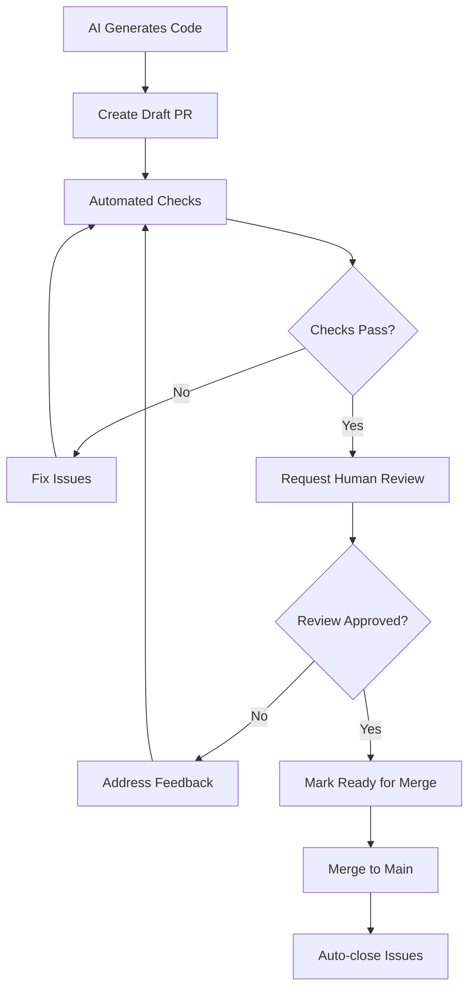

# GitHub Copilot & Cursor Integration Guide

## Overview

BB Agent Manager is fully compatible with GitHub Copilot, Cursor, and other AI coding assistants. It supports Claude 3.5 Sonnet, GPT-4, Gemini, and other premium models with proper human review workflows.

## Supported AI Models

### Premium Models
- **Claude 3.5 Sonnet** (Anthropic) - Latest and most capable Claude model
- **Claude 3 Opus** - Highest capability for complex tasks
- **Claude 3 Sonnet** - Balanced performance
- **Claude 3 Haiku** - Fast and efficient
- **GPT-4o** (OpenAI) - Latest GPT-4 model
- **GPT-4 Turbo** - Fast GPT-4 variant
- **GPT-4** - Standard GPT-4
- **o1-preview** - Reasoning model
- **o1-mini** - Lightweight reasoning model
- **Gemini 1.5 Pro** (Google) - Large context window
- **Gemini 1.5 Flash** - Fast and efficient

### Local Models
- **Ollama** - Run models locally (Llama 3.1, DeepSeek Coder, CodeLlama, etc.)

## Configuration

### Environment Variables

```bash
# Choose your provider (claude, openai, gemini, ollama)
export BB_AM_DEFAULT_PROVIDER=claude

# Anthropic Claude
export ANTHROPIC_API_KEY=sk-ant-xxxxx
export ANTHROPIC_MODEL=claude-3-5-sonnet-20241022

# OpenAI GPT
export OPENAI_API_KEY=sk-xxxxx
export OPENAI_MODEL=gpt-4o

# Google Gemini
export GEMINI_API_KEY=xxxxx
export GEMINI_MODEL=gemini-1.5-pro

# Ollama (local)
export OLLAMA_BASE_URL=http://localhost:11434/v1
export OLLAMA_MODEL=deepseek-coder:6.7b

# GitHub Integration
export GITHUB_TOKEN=ghp_xxxxx
export GITHUB_REPO=owner/repo

# Code Review Settings
export BB_AM_REQUIRE_HUMAN_REVIEW=true        # Always require human review (default: true)
export BB_AM_AUTO_CLOSE_ISSUES=true           # Auto-close issues when PR merges (default: true)
export BB_AM_CREATE_DRAFT_PRS=true            # Create PRs as drafts (default: true)
```

## GitHub Copilot Integration

### Using with Copilot Chat

1. **Start BB Agent Server**:
   ```bash
   python3 start_agent.py --provider claude
   ```

2. **Use Copilot Chat** in VS Code:
   - Open GitHub Copilot Chat (`Ctrl+Alt+I` or `Cmd+Option+I`)
   - Ask questions about your code
   - BB Agent Manager can complement Copilot with:
     - DevDocs documentation
     - Component reusability analysis
     - Labs integration for reusable components

3. **Copilot + BB Agent Workflow**:
   ```
   1. Use Copilot Chat for code suggestions
   2. Use BB Agent for documentation: "Document this new feature"
   3. Use BB Agent for PR creation: "Create PR for these changes"
   4. Copilot + BB Agent review the code together
   ```

### Copilot Workspace Integration

BB Agent Manager works alongside Copilot Workspace:
- **Copilot**: Generates code suggestions
- **BB Agent**: Documents changes, creates PRs, manages issues
- **Together**: Complete end-to-end development workflow

## Cursor Integration

### Setup for Cursor IDE

1. **Install Cursor**: Download from https://cursor.sh/

2. **Configure BB Agent API**:
   ```json
   // .cursor/settings.json
   {
     "bb-agent-manager": {
       "enabled": true,
       "apiUrl": "http://localhost:8001",
       "provider": "claude",
       "model": "claude-3-5-sonnet-20241022"
     }
   }
   ```

3. **Use Cursor Composer** with BB Agent:
   - Open Cursor Composer (`Ctrl+K` or `Cmd+K`)
   - Request code changes
   - BB Agent handles documentation and PR creation

### Cursor + BB Agent Workflow

```bash
# 1. Start BB Agent with Claude Sonnet
export BB_AM_DEFAULT_PROVIDER=claude
export ANTHROPIC_MODEL=claude-3-5-sonnet-20241022
python3 start_agent.py

# 2. In Cursor, use Composer to generate code
# Cursor will use its AI (GPT-4 or Claude)

# 3. Use BB Agent to document changes
curl -X POST http://localhost:8001/agent/chat \
  -H "Content-Type: application/json" \
  -d '{
    "provider": "claude",
    "messages": [{
      "role": "user",
      "content": "Document the authentication system changes in src/auth/"
    }]
  }'

# 4. Create PR with BB Agent
curl -X POST http://localhost:8001/agent/mcp/invoke \
  -H "Content-Type: application/json" \
  -d '{
    "name": "create_pull_request",
    "arguments": {
      "title": "feat: Add OAuth2 authentication",
      "body": "Implemented OAuth2 with JWT tokens...",
      "head": "feature/auth",
      "reviewers": ["senior-dev"],
      "labels": ["ai-generated", "enhancement"]
    }
  }'
```

## Human Review Workflow

### Automated Safety Checks

All AI-generated code goes through mandatory review:

1. **Draft PRs**: PRs created as drafts by default
2. **AI Label**: Automatically tagged with `ai-generated` label
3. **Required Reviews**: CODEOWNERS automatically notified
4. **Auto-merge Blocked**: Cannot auto-merge AI-generated PRs
5. **Check Requirements**: Must pass all tests before review

### Review Process



### GitHub Actions Workflows

The repository includes automated workflows:

#### 1. Code Review Checks (`.github/workflows/code-review.yml`)
- **Code Quality**: Black, isort, Pylint, mypy
- **Tests**: Pytest with coverage
- **Security**: Bandit security scanning
- **AI Detection**: Flags AI-generated code
- **Review Requirements**: Enforces human review

#### 2. Auto-Close Issues (`.github/workflows/auto-close-issues.yml`)
- Automatically closes issues when PR merges
- Only for PRs that pass all checks
- Adds closing comment with PR reference

### CODEOWNERS

The `CODEOWNERS` file ensures:
- Senior engineers review core logic
- AI/ML team reviews LLM providers
- Security team reviews sensitive code
- DevOps reviews workflows

## Usage Examples

### Example 1: Feature Development with Claude Sonnet

```bash
# 1. Set up Claude Sonnet
export BB_AM_DEFAULT_PROVIDER=claude
export ANTHROPIC_API_KEY=sk-ant-xxxxx
export ANTHROPIC_MODEL=claude-3-5-sonnet-20241022

# 2. Start server
python3 start_agent.py

# 3. Use Copilot/Cursor to write code

# 4. Document with BB Agent
curl -X POST http://localhost:8001/agent/chat \
  -H "Content-Type: application/json" \
  -d '{
    "provider": "claude",
    "messages": [{
      "role": "user",
      "content": "Document the new user authentication feature"
    }]
  }'

# 5. Create reviewed PR
curl -X POST http://localhost:8001/agent/mcp/invoke \
  -H "Content-Type: application/json" \
  -d '{
    "name": "create_pull_request",
    "arguments": {
      "title": "feat: Add user authentication system",
      "body": "Closes #123\n\n## Changes\n- OAuth2 implementation\n- JWT token handling\n- User session management",
      "head": "feature/user-auth",
      "base": "main",
      "reviewers": ["tech-lead"],
      "labels": ["feature", "ai-generated"]
    }
  }'
```

### Example 2: Bug Fix with GPT-4

```bash
# 1. Set up GPT-4
export BB_AM_DEFAULT_PROVIDER=openai
export OPENAI_API_KEY=sk-xxxxx
export OPENAI_MODEL=gpt-4o

# 2. Fix bug with Copilot assistance

# 3. Document fix
python3 chat_client.py --provider openai
> "Document the fix for issue #456 regarding null pointer exception"

# 4. Create PR
> "Create a pull request for this bug fix targeting issue #456"
```

### Example 3: Code Review with Multiple Models

```bash
# Use Claude for initial review
curl -X POST http://localhost:8001/agent/chat \
  -d '{"provider": "claude", "messages": [{"role": "user", "content": "Review src/payment.py"}]}'

# Use GPT-4 for second opinion
curl -X POST http://localhost:8001/agent/chat \
  -d '{"provider": "openai", "messages": [{"role": "user", "content": "Review src/payment.py for security issues"}]}'

# Use Gemini for documentation review
curl -X POST http://localhost:8001/agent/chat \
  -d '{"provider": "gemini", "messages": [{"role": "user", "content": "Review API documentation completeness"}]}'
```

## Safety Guardrails

### Built-in Protections

1. **Draft PRs**: All AI-generated PRs are drafts
2. **Labeling**: `ai-generated` label for transparency
3. **Review Requirements**: CODEOWNERS enforced
4. **Check Gating**: Must pass CI/CD before merge
5. **No Auto-merge**: Disabled for AI code
6. **Audit Trail**: Full history in PR comments

### Configuration Options

```bash
# Disable draft PR creation (not recommended)
export BB_AM_CREATE_DRAFT_PRS=false

# Disable auto-close issues
export BB_AM_AUTO_CLOSE_ISSUES=false

# Require human review (always enabled, cannot disable)
export BB_AM_REQUIRE_HUMAN_REVIEW=true
```

## Best Practices

### 1. Model Selection
- **Claude 3.5 Sonnet**: Best for complex code generation and reasoning
- **GPT-4o**: Fast and capable for most tasks
- **Gemini 1.5 Pro**: Great for large context/codebase analysis
- **Ollama**: Privacy-sensitive or offline development

### 2. Review Process
- Always review AI-generated code before approving
- Check for security vulnerabilities
- Verify logic and edge cases
- Ensure tests are comprehensive
- Validate documentation accuracy

### 3. PR Workflow
- Use descriptive PR titles and bodies
- Link to related issues with `fixes #123`
- Request specific reviewers with expertise
- Add appropriate labels
- Keep PRs focused and small

### 4. Issue Management
- Only auto-close when confident PR resolves issue
- Add detailed closing comments
- Reference PR number in issue close

## Troubleshooting

### Copilot Not Working
```bash
# Check Copilot status
gh copilot status

# Reinstall Copilot extension
code --install-extension GitHub.copilot
```

### Cursor Connection Issues
```bash
# Verify BB Agent is running
curl http://localhost:8001/health

# Check Cursor settings
cat .cursor/settings.json
```

### Model API Errors
```bash
# Test Claude
curl https://api.anthropic.com/v1/messages \
  -H "x-api-key: $ANTHROPIC_API_KEY" \
  -H "anthropic-version: 2023-06-01"

# Test OpenAI
curl https://api.openai.com/v1/models \
  -H "Authorization: Bearer $OPENAI_API_KEY"

# Test Gemini
curl "https://generativelanguage.googleapis.com/v1/models?key=$GEMINI_API_KEY"
```

## Advanced Integration

### Custom Copilot Instructions

Create `.github/copilot-instructions.md`:

```markdown
# Copilot Instructions for BB Agent Manager

When generating code:
1. Always use BB Agent Manager for documentation
2. Create PRs through BB Agent API
3. Tag PRs with 'ai-generated' label
4. Request review from appropriate team members
5. Document component reusability in devdocs

Code standards:
- Follow PEP 8 for Python
- Use type hints
- Write comprehensive tests
- Include docstrings
```

### Cursor Rules

Create `.cursorrules`:

```
# BB Agent Manager Cursor Rules

## Code Generation
- Use async/await for I/O operations
- Implement proper error handling
- Add logging for debugging
- Write tests for all functions

## Documentation
- Use BB Agent for technical documentation
- Document API changes in devdocs
- Update README for new features

## PR Creation
- Create PRs through BB Agent API
- Include detailed description
- Link related issues
- Request appropriate reviewers
```

## Summary

BB Agent Manager provides enterprise-grade AI coding assistant integration with:

✅ **Multiple Premium Models**: Claude Sonnet, GPT-4, Gemini
✅ **Copilot Compatible**: Works alongside GitHub Copilot
✅ **Cursor Integrated**: Full Cursor IDE support
✅ **Human Review Required**: Mandatory review for AI code
✅ **Automated Checks**: CI/CD gating before merge
✅ **Issue Management**: Auto-close on successful merge
✅ **Audit Trail**: Full transparency and traceability

Start using premium models safely with proper human oversight! 🚀